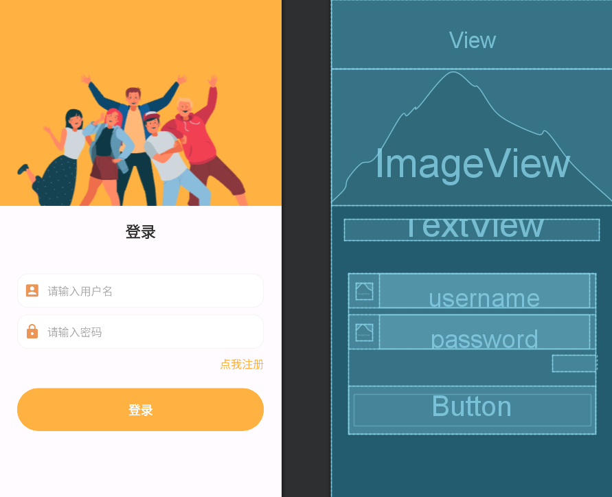

## 功能介绍

移动程序开发课程作业，基于Android Studio开发的一款android程序，目前仅包含页面设计，不具有实际功能。

## 登录页面

一个简单的登录页面，允许用户输入账户名，密码，并进行注册、登录操作（目前不具备数据库，即输入任意用户名和密码均可登录），登录后将跳转至主页面。

在输入密码时，会对输入框中的密码进行加密（转换为星号），登录时检验用户名和密码是否为空，如果为空则给出相应提示。

设计蓝图如下：

登录过程（登录成功后跳转至主页面）：

<table>
  <tr>
    <td></td>
    <td></td>
    <td></td>
  </tr>
</table>

## 注册页面

正在开发中...

## 主页面

目前不包含实际功能，仅用来提示登陆成功。

